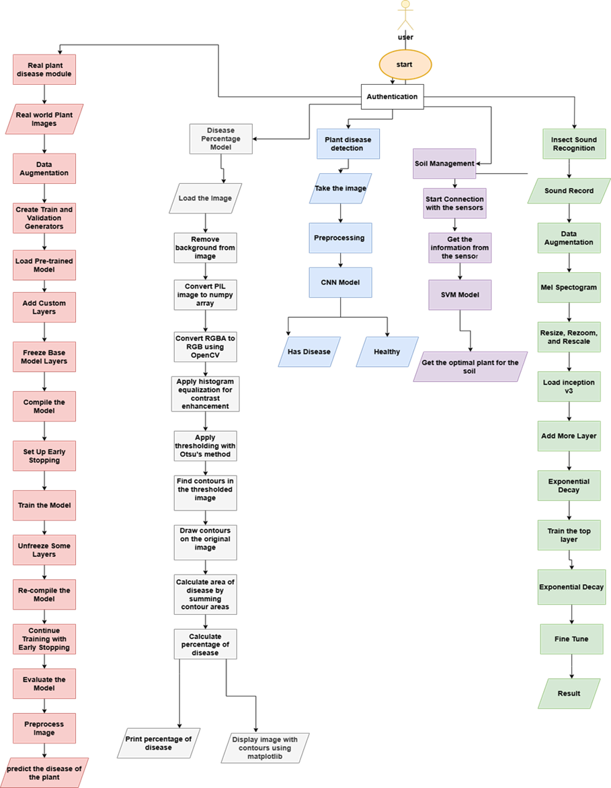

#Farmer Guide
(We removed migrations and put AI models in gitignore due to size uploading issues)

##Problem Definition
In the ever-evolving landscape of agriculture, 
The farmer suffers from many problems, 
such as the crop becoming infected with diseases or the spread of harmful insects, 
and sometimes the soil is not suitable for growing some crops in the first place.
Working on these problems requires a lot of labor, money, and time, which may be too late to solve the problem.

##Introduction
Developing Farmer Guide application.
Which provides solutions through 4 approaches : 
Image detection system.
Sounds detection system.
Soil management and crop recommendation. 
Image Segmentation system.
This project helps the farmer in many tasks such as saving time, effort, labor, 
and rationalizing the use of fertilizers in solving agriculture and planting crops problems.

##Proposed System

##Existing work 
### 1. Image detection system
BenchMark Dataset
New plant disease dataset is used new planet disease.
The dataset consists of:
87000 RGB image of healthy and unhealthy leaves of plants.       
38 class. 
The total dataset is divided into 80/20 ratio of training and validation set preserving the directory structure.
A new directory containing 33 test images is created later for prediction purpose.
When we apply CNN model with specific layers on this data that give us accuracy 98.12% and when using transfer learning using MobileNet V2 get 95.48% on validation. 
Real Dataset
Plant diseases on Egypt.
The dataset consists of:
31 RGB image and after Augmentation make dataset contain 146 RGB image of unhealthy leaves of plants.
5 class.
The total dataset is divided into training and validation set preserving the directory structure.
When we apply MobileNetV2 model with on this Augmentation data that give us accuracy 97.83% .

### 2. Sounds detection system
Dataset and Pre-processing
The dataset comprises 69 WAV samples.
The dataset is organized into three distinct classes.
The first class comprises bugs that pose a threat to human health.
The second class encompasses bugs that have an impact on plant health.
Lastly, the third class consists of bugs that feed on plants.
We used data augmentation with four techniques:
Time shifting
Time stretching
Pitch shifting (scaling)
Noise injection
We get the Mel spectrogram for each sample as pre-processing.
Learning
We cleaned the data set before applying all the models and preprocessing it before loading it in the model.
For model development, 80% of the dataset was allocated for training.
The remaining 20% was designated for testing to evaluate the model's generalization performance.
The samples were selected randomly, ensuring a representative and unbiased distribution across both the training and testing sets
We used ResNet-4Blocks as a classification model.
Accuracy
Before data augmentation, the accuracy was 34%.
After data augmentation, the cumulative result of the training strategy yields a robust model with a final accuracy of 91.38%. This accuracy reflects the model's capability to accurately identify and classify various bugs sounds based on Mel Spectrograms.
we use Resnet but with different arctucture and get 91.38% accuracy and with MobileNet get 89% and with Inception get 90% and we start changing learning rate Rondomly on each epoch and get 93% and after that when using exponential decay as optimixation techniq get 95% as a final accuracy.  

### 3. Soil Management and Crop Recommendation
Dataset
The dataset comprises soil samples(100 for each) with some measurements/features read from the sensors in and around it:
nitrogen (N)
phosphorus (P)
potassium (K)
Temperature
Humidity
pH
rainfall
And we have (22) of crops/classes commonly cultivated in agricultural practices.
Learning
We have used three models (SVM, KNN and Decision Tree) once with the  dataset of the whole features of soil nutrient levels and environmental factors, and once with the dataset of NPK levels only. 
Decrease in accuracy ratio due to the downfall of number of features and the small number of samples. 
Final Results
We enhanced this work when using normalization using spread of samples at each class and make a range of (mean(M)+/-1*standard deviation(SD)) and generate/augment new samples only within that range. 
This made the whole dataset contain 11000 samples and got the accuracy from 65% to 80%.

### 4. image segmentation system
Mechanism
After we getting the image from user make background removing using PIL and after that make noise remover and apply contrast on image after that we change image to gray scale for prepare it to contour the disease area with specific numbers of threshold and calculate the percentage of the disease.  